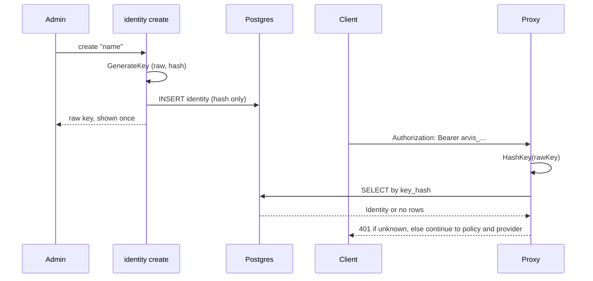

<!--markdownlint-disable-->
# Auth and Identity

## 1. High-Level Overview
- **Purpose:** Attribute every proxied AI request to a known identity (an employee or a service) before it can reach a provider. No identity, no request.
- **Scope:** Machine to machine API keys only. Human dashboard sessions and SSO are not handled here yet.
- **Key Dependencies:** PostgreSQL (`identities` table), `internal/auth` (key primitives), `internal/store` (lookup), `internal/proxy` (enforcement point), the `identity create` CLI command (issuance).

## 2. Architecture & Data Flow

Order inside the proxy: authenticate, resolve provider, read body, policy check, tokenize, forward with the provider key.

## 3. Key Technical Decisions & Trade-Offs
- **Store only the hash.** A database leak does not expose usable keys. Trade-off: lost keys cannot be recovered, only reissued.
- **Plain SHA-256, not bcrypt or argon2.** Keys are 256-bit random, so brute force is infeasible and slow hashing would only add latency to every request. This would be wrong for human passwords.
- **Prefix excluded from the hash.** The `arvis_` prefix helps users, log search, and secret scanners (such as GitHub regex detection). Hashing it would tie stored data to key formatting. Prefixes can now change (for example `arvis_v2_`) without invalidating keys.
- **Lookup by hash in SQL.** One indexed query per request. Because the caller cannot choose hash bytes, timing differences in the index lookup do not leak usable information.
- **Constant time comparison as defense in depth.** `EqualHashes` is applied to the fetched hash after lookup.
- **API keys now, SSO later.** OIDC and SAML 2.0 (Entra ID, Okta, ADFS, Keycloak) cover human users and are configured through environment settings. They are a separate layer and do not replace machine keys.
- **Known limitations:** no revocation flag, no expiry, no last-used tracking, no rate limit on failed authentication.

## 4. Invariants & Security
- Raw keys are never logged, stored, or recoverable after issuance.
- Only the SHA-256 digest is persisted or queried.
- The ARVIS key never leaves ARVIS: the proxy replaces `Authorization` with the provider key on the outbound request.
- Authentication runs before any body read, policy check, or provider call.
- Authentication fails closed: any lookup error rejects the request.
- `Identity.KeyHash` is tagged `json:"-"` and must never be serialized.
- `key_hash` must be `UNIQUE` in the schema.

## 5. Failure Modes & Operational Guidance

| Situation | Behavior |
|---|---|
| Missing or malformed header | 401, `missing or malformed authorization header` |
| Key matches no identity | 401, `key does not match any known identity` |
| Postgres unavailable | Request rejected (currently reported as 401, should be 503) |
| Key leaked | Valid until the identity row is removed (no revoke flag yet) |
| Key lost | Not recoverable, issue a new identity |

**How to test**
- Unit: `go test ./internal/auth/...` (round trip: `HashKey(raw)` equals the hash from `GenerateKey`; prefixed and bare secret hash the same).
- Manual: create an identity, then send a request with the key and with a wrong key, and confirm 200 versus 401.

**Monitoring & alerts**
- Log line `proxy request rejected` with status 401: watch for spikes (probing or a misconfigured client).
- A burst of 401s that coincides with database errors points to an outage, not bad keys.

**Runbooks**
- Issue a key: `arvis identity create "<name>"`, then hand over the printed key once through a secure channel. Adjust the command to the real binary name.
- Rotate a key: create a new identity, move the caller over, then remove the old row.
- Revoke a key: no command exists yet. Deleting the row works only if foreign keys on `requests` allow it, so verify the schema first. A `revoked_at` column is the proper fix.